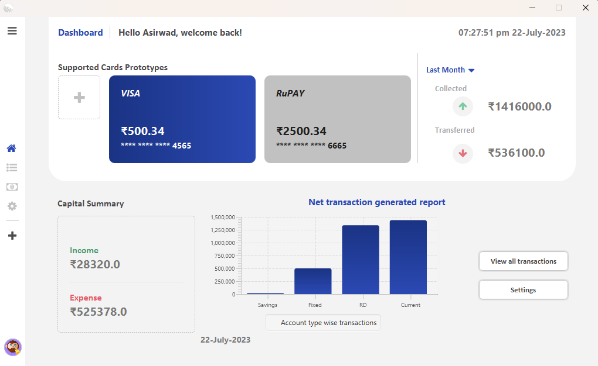
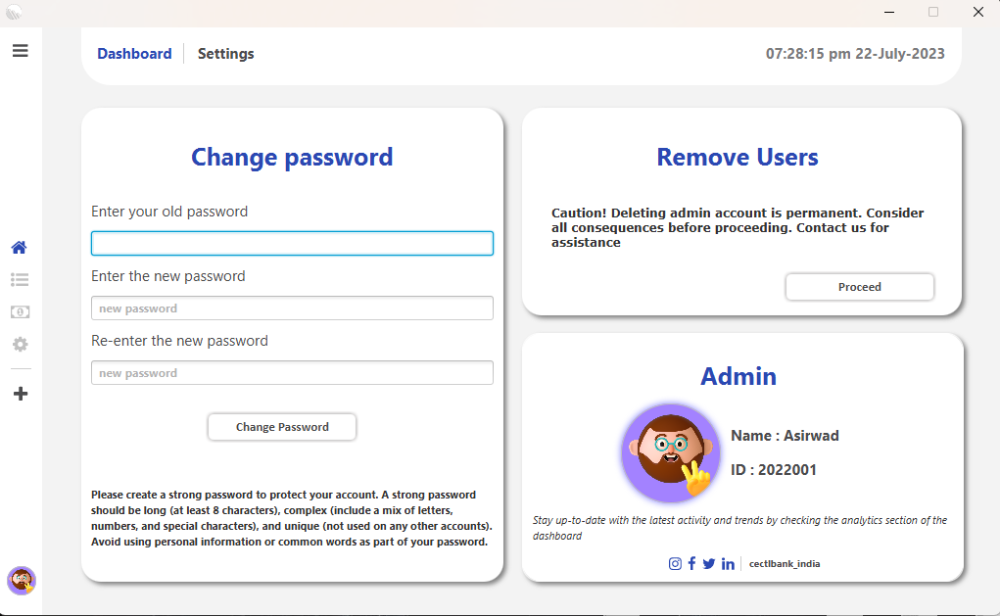

<h1 align=center> ATM-Management-system </h1>

  

## Table of Contents
- [Project Description](#project-description)
- [Installation](#installation)
- [Usage](#usage)
- [Features](#features)
- [Dependencies](#dependencies)
- [Contributing](#contributing)
- [Contact Information](#contact-information)

## Project Description
The ATM Management System is a software application developed in JavaFX that provides an ATM interface for users to perform various banking transactions such as depositing, withdrawing, checking balance, and changing PIN. Additionally, the application also includes an admin dashboard that allows administrators to manage, view, and control ATM transactions, as well as manage user accounts.

## Installation
1. Clone the repository: `git clone <repository_url>`
2. Navigate to the project directory: `cd ATM-Management-System`
3. Compile the Java code: `javac Main.java`
4. Run the application: `java Main`

## Usage
1. Launch the ATM Management System application.
2. Follow the on-screen instructions to perform desired transactions such as deposit, withdrawal, balance inquiry, and PIN change.
3. Admins can log in to the admin dashboard to manage transactions and user accounts.

## Features
- User Interface for ATM transactions (deposit, withdrawal, balance inquiry, and PIN change)
- Admin dashboard for managing transactions and user accounts
- Secure authentication system
- User-friendly and intuitive interface
- Error handling and validation for input fields
- Detailed transaction logs

## Dependencies
The following dependencies are required to run the ATM Management System:
- JavaFX
- Java Development Kit (JDK)

  

  

Make sure you have these dependencies installed and properly configured before running the application.

## Contributing
Contributions to the ATM Management System project are welcome! If you would like to contribute, please follow these guidelines:
1. Fork the repository.
2. Create a new branch for your feature or bug fix: `git checkout -b feature/your-feature-name`.
3. Make your changes and commit them with descriptive commit messages.
4. Push your changes to your forked repository.
5. Submit a pull request to the main repo

## Contact Information
For any questions, suggestions, or feedback, please feel free to reach out to the project maintainer at asirwadsali@gmail.com.

